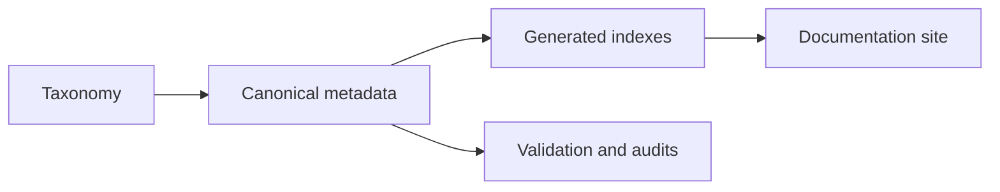

# Physical AI Survey Resource

This repository connects a Physical AI survey with curated papers, code records, dataset cards, benchmark definitions, tutorials, and a geoscience and remote-sensing specialty track. It distinguishes physics-informed scientific AI from embodied physical intelligence and treats bibliographic metadata, provenance, license status, and verification state as first-class records.



Text equivalent: taxonomy and canonical metadata drive generated indexes, documentation, and audits.

## Navigation

- [Overview](00-overview/index.md)
- [Knowledge base](01-knowledge-base/index.md)
- [Paper library](02-paper-library/index.md)
- [Code library](03-code-library/index.md)
- [Dataset library](04-dataset-library/index.md)
- [Benchmarks and evaluation](05-benchmarks-and-evaluation/index.md)
- [Case studies](06-case-studies/index.md)
- [Extended resources](07-extended-resources/index.md)
- [Geoscience and carbon flux track](06-case-studies/geoscience-remote-sensing/index.md)

## Resource counts

<!-- resource-counts:start -->
Generated from canonical metadata. Do not edit manually.

- Public papers: 100
- Public code records: 8
- Public datasets: 8
- Public benchmarks: 5
<!-- resource-counts:end -->

## Scope

Physics-informed scientific AI covers machine learning systems that incorporate scientific priors, equations, operators, simulators, uncertainty, or physically meaningful evaluation. Embodied physical intelligence covers systems that perceive, reason, plan, and act in the physical world. The repository records both branches without merging them into one taxonomy.

## Build and validation

```bash
python -m scripts.generate_indexes
python -m scripts.validate_metadata
python -m scripts.check_internal_links
python -m scripts.check_generated_files
python -m scripts.check_large_files
python -m scripts.check_repository_hygiene
pytest
```

Network checks are separated:

```bash
python -m scripts.verify_external_links --respect-cache --report
```

## Contribution

See [CONTRIBUTING.md](CONTRIBUTING.md). New resources must include source URLs, evidence level, verification date, license/access status, and controlled taxonomy labels.

## Citation

Cite this resource using [CITATION.cff](CITATION.cff). Third-party papers, code, datasets, and benchmarks retain their own citation and license requirements.
